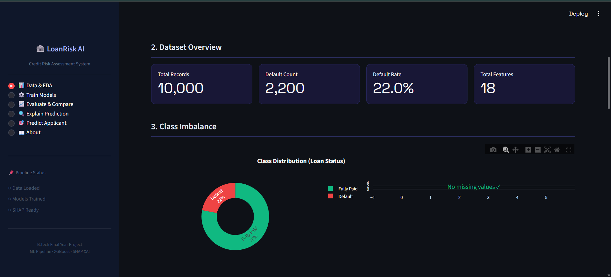
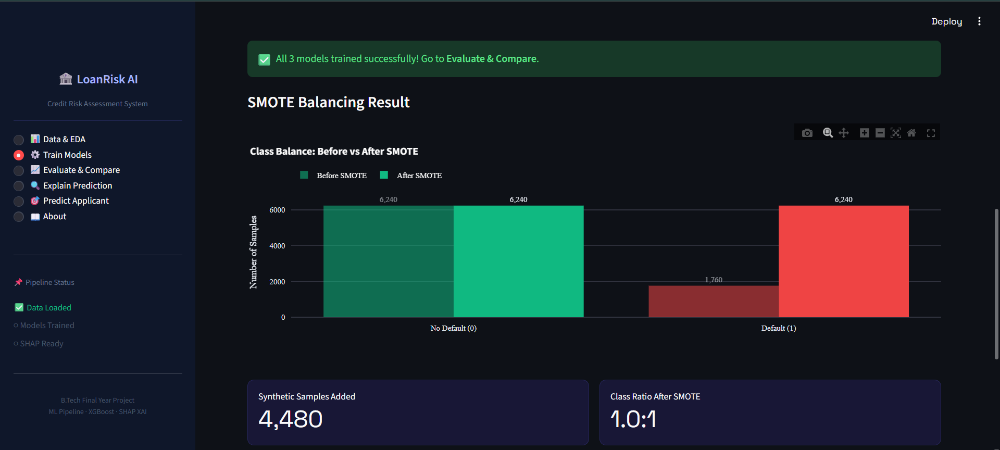
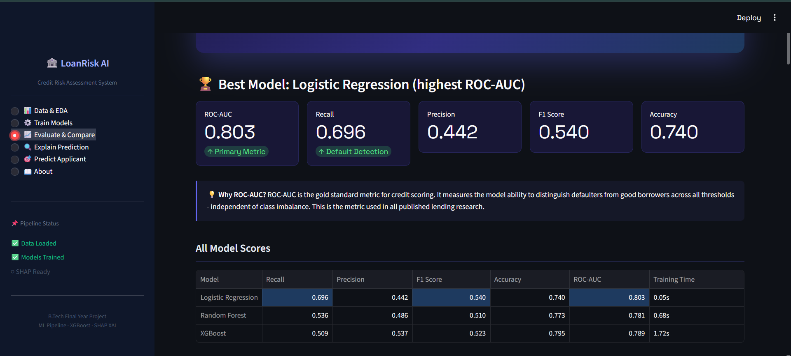
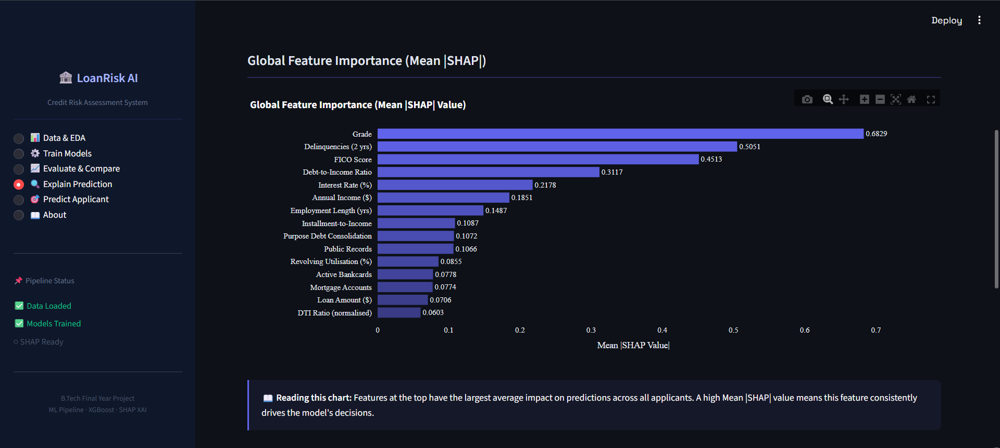
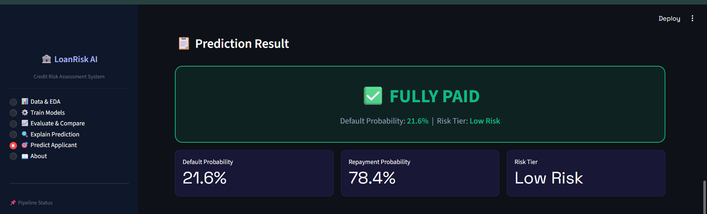
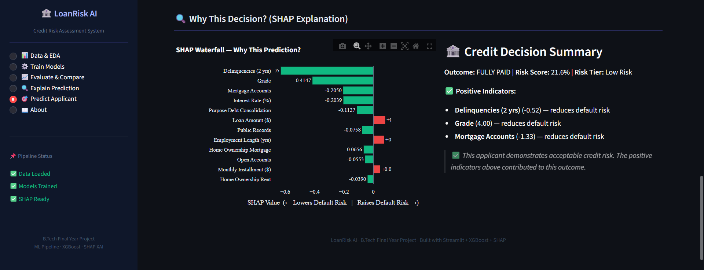

# 🏦 LoanRisk AI — Loan Default Prediction System
### B.Tech Final Year Project | ML + Explainable AI + Streamlit

---

## 📌 Project Overview

A **complete end-to-end Credit Risk Assessment System** that predicts whether a loan applicant is likely to default, using real financial data, state-of-the-art ML models, and SHAP-powered explanations that meet banking regulations.

| Feature | Detail |
|---|---|
| **Dataset** | Lending Club Loan Data (Kaggle) or built-in synthetic demo |
| **Models** | Logistic Regression, Random Forest, XGBoost |
| **Imbalance Handling** | SMOTE (Synthetic Minority Over-sampling) |
| **Primary Metric** | Recall (catching defaulters is the priority) |
| **Explainability** | SHAP — global + per-prediction waterfall charts |
| **Interface** | Multi-page Streamlit web app |

---

## 📸 Application Screenshots

### 📊 Data Loading & Exploratory Data Analysis



---

### ⚙️ Model Training Pipeline



---

### 📈 Model Evaluation & Comparison



---

### 🔍 Explainable AI with SHAP



---

### 🎯 Applicant Risk Prediction



---

### 🧠 Why This Prediction? (SHAP Waterfall Explanation)



---

## 🚀 Quick Start

### 1. Install Dependencies
```bash
pip install -r requirements.txt
```

### 2. Run the App
```bash
streamlit run app.py
```

### 3. Use Demo Mode
Click **"Generate Demo Data"** on the Data & EDA page — no Kaggle download needed.

### 4. Use Real Lending Club Data (Recommended for Final Demo)
1. Go to: https://www.kaggle.com/datasets/wordsforthewise/lending-club
2. Download `accepted_2007_to_2018Q4.csv.gz`
3. Upload via the app's file uploader
4. The app handles all preprocessing automatically

---

## 📁 Project Structure

```
loan_default_predictor/
│
├── app.py                        # Main Streamlit application (5 pages)
├── requirements.txt              # Python dependencies
├── README.md                     # This file
│
├── pipeline/
│   ├── data_loader.py            # Phase 1: EDA, cleaning, charts
│   ├── feature_engineering.py   # Phase 2: DTI, credit util, encoding, scaling
│   ├── imbalance.py              # Phase 3: SMOTE balancing
│   ├── models.py                 # Phase 4: LR / RF / XGBoost training
│   ├── evaluation.py             # Phase 5: Recall, ROC-AUC, cost-benefit
│   └── explainability.py        # Phase 6: SHAP global + per-prediction
│
└── data/
    └── sample_data.py            # Synthetic Lending Club-style data generator
```

---

## 🧪 6-Phase ML Pipeline

| Phase | Module | What Happens |
|---|---|---|
| **1** | `data_loader.py` | Load CSV, handle missing values, cap outliers, EDA charts |
| **2** | `feature_engineering.py` | Engineer DTI ratio, credit utilisation, installment-to-income etc |
| **3** | `imbalance.py` | Stratified 80/20 split → apply SMOTE to training set only |
| **4** | `models.py` | Train LR (baseline), Random Forest, XGBoost with configurable params |
| **5** | `evaluation.py` | Recall, Precision, F1, ROC-AUC, Confusion Matrix, Financial Impact |
| **6** | `explainability.py` | SHAP global summary + waterfall chart per prediction |

---

## 📊 Key Design Decisions

### Why Recall as Primary Metric?
A **False Negative** (approving a loan that defaults) costs the bank ~60% of the loan value.
A **False Positive** (rejecting a good customer) costs only ~5% in missed interest.
Therefore, **catching defaulters (Recall)** matters far more than overall accuracy.

### Why SMOTE?
Real Lending Club data has ~80% "Fully Paid" and ~20% "Charged Off" records.
Without correction, a naive model simply predicts "Fully Paid" for everyone and achieves 80% accuracy — which is useless.
SMOTE generates realistic synthetic minority-class samples using k-nearest neighbors on the training set only.

### Why XGBoost?
Academic literature consistently shows XGBoost achieves **ROC-AUC of 0.85–0.95** on credit risk datasets, outperforming LR and SVM by a large margin. It handles non-linear feature interactions, missing values natively, and is highly interpretable via SHAP.

### Why SHAP for Explainability?
Banks are legally required (e.g., ECOA, GDPR) to explain credit decisions to customers.
SHAP values assign each feature a fair contribution score — mathematically grounded in game theory (Shapley values).

---

## 🎯 Examiner Demo Flow (Recommended)

1. Open the app: `streamlit run app.py`
2. **Data & EDA**: Click "Generate Demo Data" → show class imbalance chart
3. **Train Models**: Keep defaults, enable SMOTE → click "Run Full Training Pipeline"
4. **Evaluate & Compare**: Show ROC-AUC curves and Confusion Matrices
5. **Explain Prediction**: Compute SHAP → show global feature importance
6. **Predict Applicant**: Click "Fill Demo Applicant" → "Assess Credit Risk" → show SHAP waterfall

Total demo time: ~5 minutes

---

## 📚 Technologies Used

- `streamlit` — web interface
- `pandas`, `numpy` — data manipulation
- `scikit-learn` — preprocessing, Logistic Regression, Random Forest
- `xgboost` — gradient boosting model
- `imbalanced-learn` — SMOTE
- `shap` — explainability
- `plotly` — interactive visualisations

---

## 👥 Contributors

This project was developed collaboratively as a B.Tech Final Year Project.

| Contributor      | GitHub Profile                      |
| ---------------- | ----------------------------------- |
| Ayush Srivastava | https://github.com/Ayushblank02     |
| Kamal Mehta      | https://github.com/itskamalmehta    |
| Garv Kumar       | https://github.com/Garv-Kumar       |
| Anshuman Raj     | https://github.com/AnshumanRaj13    |
| Piyush Prashar   | https://github.com/Piyushprashar777 |

### Acknowledgement

All contributors participated in the design, development, testing, documentation, and research associated with the LoanRisk AI project and its accompanying research work.

---
